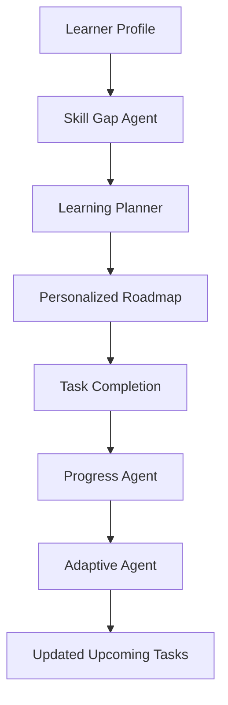
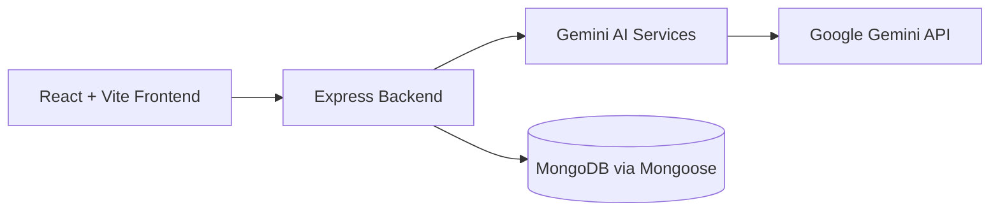

# EduPath

## AI-Powered Personalized Learning & Adaptive Skill Development

EduPath is an AI-powered learning platform that turns a learner profile into a focused, adaptable career-learning journey. It understands a learner's current skills, identifies gaps against a target role, generates a roadmap, tracks task completion, evaluates progress, and adapts upcoming work when the progress data supports a change.

> EduPath does not just generate a roadmap once. It continuously evaluates learner progress and adapts the learning journey.

## Problem

Generic learning platforms often give every learner the same path. That leaves learners unsure about:

- Which skills they are missing for a target role
- What to learn first
- How to structure their time
- Whether they are progressing appropriately
- How to adjust their plan when they need more practice

## Solution

EduPath uses a staged AI workflow to connect learner context with practical learning actions:



Completed work stays part of the learner's roadmap. Adaptation focuses on future or uncompleted work rather than regenerating the entire plan.

## Agentic Architecture

### Skill Gap Agent
Analyzes the learner's current skills against their target role and identifies relevant skill gaps, including current level, required level, gap size, priority, and reason.

### Learning Planner Agent
Converts the identified gaps into a structured roadmap with weekly objectives, learning/practice/project tasks, estimated times, and week projects.

### Progress Agent
Analyzes the supplied roadmap, completed task information, and calculated progress to identify completed areas, areas needing attention, recommendations, and whether adaptation is warranted.

### Adaptive Agent
Uses the progress report to modify upcoming or uncompleted learning tasks while preserving completed work. The frontend lets the learner review and apply the returned adaptation.

The implemented agent loop is:

```text
OBSERVE → REASON → PLAN → ACT → EVALUATE → ADAPT
```

## Key Features

- Learner profile creation
- Skill-level tracking on a 1–5 scale
- AI skill-gap analysis
- Personalized learning roadmap generation
- Weekly learning objectives and projects
- Learning, practice, and project task types
- Task completion tracking
- Overall and weekly progress calculation
- AI progress analysis
- Adaptive roadmap generation
- Apply-adaptation workflow for upcoming tasks
- Browser `localStorage` persistence for profile, roadmap, task completion, progress, and adaptation state
- Responsive React dashboard for desktop, tablet, and mobile layouts

## Tech Stack

### Frontend

- React
- Vite
- CSS

### Backend

- Node.js
- Express.js
- CORS
- dotenv

### Database

- MongoDB
- Mongoose

### AI

- Google Gemini API
- `@google/genai`

## System Architecture



The frontend communicates with the Express API. Gemini calls are made by backend services only. `GEMINI_API_KEY` and `MONGO_URI` remain server-side and are never sent to the React application.

## Project Structure

```text
EduPath/
├── Client/
│   ├── src/
│   │   ├── App.jsx
│   │   ├── App.css
│   │   ├── index.css
│   │   └── main.jsx
│   ├── public/
│   ├── index.html
│   ├── package.json
│   ├── vite.config.js
│   └── eslint.config.js
├── Server/
│   ├── models/
│   │   └── profile.js
│   ├── routes/
│   │   └── profileRoutes.js
│   ├── services/
│   │   ├── geminiService.js
│   │   └── geminiservices.js
│   ├── server.js
│   ├── package.json
│   └── .env
└── README.md
```

`Server/services/geminiService.js` contains the active Gemini service functions used by the routes.

## API Overview

The backend runs on port `5000` by default and mounts profile routes at `/api/profiles`.

| Method | Endpoint | Purpose |
| --- | --- | --- |
| `GET` | `/` | Health response confirming the EduPath backend is running |
| `POST` | `/api/profiles` | Create and save a learner profile in MongoDB |
| `GET` | `/api/profiles` | Fetch saved learner profiles from MongoDB |
| `POST` | `/api/profiles/analyze` | Analyze a profile and return a structured skill-gap analysis in `analysis` |
| `POST` | `/api/profiles/plan` | Generate a roadmap from `profile` and `analysis`, returned in `plan` |
| `POST` | `/api/profiles/progress` | Evaluate `profile`, `analysis`, `plan`, completed tasks, and progress, returned in `progress` |
| `POST` | `/api/profiles/adapt` | Generate future-task adaptation from `profile`, `plan`, and `progressReport`, returned in `adaptation` |

### Request shapes

#### Analyze a profile

```json
{
  "name": "Learner",
  "targetRole": "MERN Developer",
  "skills": [
    { "name": "React", "currentLevel": 3 }
  ],
  "availableTime": "1 hour/day",
  "learningStyle": "hands-on"
}
```

#### Generate a roadmap

```json
{
  "profile": {},
  "analysis": {}
}
```

#### Analyze progress

```json
{
  "profile": {},
  "analysis": {},
  "plan": {},
  "completedTasks": ["week-1-task-1"],
  "progressPercentage": 50
}
```

#### Adapt a roadmap

```json
{
  "profile": {},
  "plan": {},
  "progressReport": {}
}
```

All AI endpoints request structured JSON from Gemini. The frontend handles temporary AI quota errors without automatically retrying.

## How to Run

### Clone

The repository URL is not specified yet, so replace the placeholder with the actual URL:

```bash
git clone <repository-url>
cd EduPath
```

### Backend

```bash
cd Server
npm install
```

Create `Server/.env` with placeholders only:

```env
MONGO_URI=your_mongodb_connection_string
GEMINI_API_KEY=your_gemini_api_key
PORT=5000
```

Never commit real credentials or paste them into the frontend.

Start the backend:

```bash
node server.js
```

The backend is available at:

```text
http://localhost:5000
```

### Frontend

Open a second terminal:

```bash
cd Client
npm install
npm run dev
```

Vite will print the local development URL, normally:

```text
http://localhost:5173
```

For a production build:

```bash
cd Client
npm run build
npm run preview
```

## Persistence

MongoDB stores learner profiles created through `POST /api/profiles`.

The current frontend stores dashboard state in browser `localStorage`, including:

- Profile data
- Skill-gap analysis
- Learning roadmap
- Completed task IDs
- Progress report
- Adaptation result
- Applied-adaptation state

Task completion remains browser-local for this MVP and is not stored in MongoDB.

## Development Checks

From `Client/`:

```bash
npm run lint
npm run build
```

The server package currently has no automated test script. Start it from `Server/` with `node server.js` for API verification.

## Notes

- Gemini responses depend on the configured API key, model availability, and account quota.
- A `429 RESOURCE_EXHAUSTED` response means the Gemini quota is temporarily unavailable; existing local roadmap and progress data remain usable.
- The frontend does not make AI calls automatically on page load. AI operations are started by the corresponding user actions.
